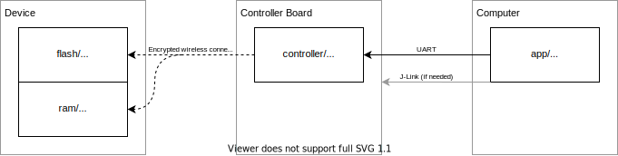

nRF5x Recovery Bootloader
=========================

Very small bootloader for nRF5x devices.
It is indendet mainly for emergency cases when others means to recover device from invalid software fails, but it can be also used as normal bootloader.

Main features of the bootloader:
- No impact on flash size - it is injected into MBR.
- Almost no impact on application: no memory shifing, no spacial ISR handling, only RESETREAS register may be affected.
- Secure connection encrypted using AES cipher.
  - Password protected access to device.
  - Each device contains unique AES key, so breaking one device will not compromise others with the same password.
- Configurable bootloader trigger: radio, GPIO, reset button, application or some combination of them.
- Bootloader have full access to device including MBR and bootloader itself.

Comonents
---------

- First stage bootloader (**`flash/`** directory)
  - Located on the second (unused) half of MBR
  - Decides whether to start bootloader or continue with normal application startup
  - Establishes secure connection
  - Downloads second stage bootloader to RAM
  - Starts second stage bootloader
- Second stage bootloader (**`ram/`** directory)
  - Erases and writes flash including MBR and UICR
  - Changes recovery bootloader configuration: password, device user frendly name, trigger method.
- Controller firmware (**`controller/`** directory)
  - It is gateway between PC and bootloader
  - Uses UART to communicate with PC
  - Will run on any board that have radio circuts and UART connected to PC
- Application (**`app/`** directory)
  - Portable application that uses Node.js and electron
  - GUI and CLI interface
  
