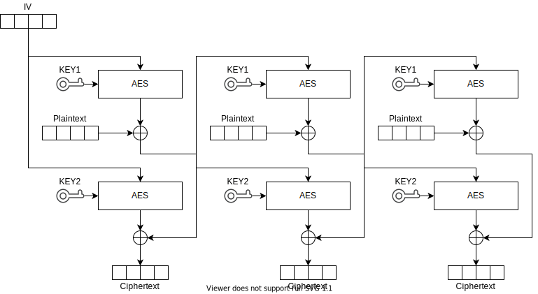

# First stage bootloader

1. Device sends **`Boot`** packets N times, where N is configurable.
2. Device switches to the receiving state.
3. Controller sends entire second stage bootloader in the **`Block`** packets.
4. When controller sends the last block, the device will verify and start second stage bootloader.
5. The controller waits for a second stage bootloader response.
6. If second stage bootloader did not start, controller repeats the procedure starting from point 3.


## `Boot`
Device sends this packet to inform that the bootloader just started and it is waiting for further communication.
It can be send more than once depending on the configuration.

| Off | Size   | Name       | Description                                            |
|----:|-------:|------------|--------------------------------------------------------|
| 0   | 8      | `Salt`     | Random salt bytes for device key generation            |
| 8   | 4      | `KeyConf`  | Key confirmation data                                  |
| 12  | 1      | `HWID`     | Value that identifies the hardware                     |
| 13  | 1      | `MaxSize`  | Second Stage Bootloader maximum size                   |
| 14  | 1      | `Counter`  | Packet repeat counter                                  |
|     | **15** |            | **Total packet size**                                  |

Each device has a unique encryption key generated from user provided *Password* using following method:
```
Salt = 8 random bytes
Key = SHA-256(Salt & Password & "RecoveryBootloaderPassword")
```
*& sign indicates concatenation.*

**`Salt`** and *Key* are stored on the device. **`Salt`** is send by this packet allowing controller to generate device *Key* for this connection.

> SECURITY NOTE: **`Salt`** may be used to uniquly indentify the device. Because of that, this protocol cannot be used
> if device needs anonymity. This can be solved by using the same **`Salt`** on every device, but this solution creates the
> same key for each device, so breaking one device allows full access to all devices.

**`KeyConf`** contains key confirmation data. After controller calculated the *Key*, it should verify if the key is correct using this field.
It contains first 4 bytes of `SHA-256(Salt & Key & "RecoveryBootloaderKey")`.

**`HWID`** field contains chip number. List of chip numbers is specific to this protocol.

**`MaxSize`** contains byte with encoded size of the area reserved for the second stage bootloader. The area always starts at the beginning of a RAM.
It is encoded in two bit fields as follows:
```
+MSB+---+---+---+---+---+---+LSB+
|         I         |     P     |      size = (32 + I) * 2 ^ (7 + P)
+---+---+---+---+---+---+---+---+
```

**`Counter`** contains integer that tells how many **`Boot`** packets will be send after this one.
Last **`Boot`** packet will have **`Counter`** equals zero. This field is used to calculate time to start sending **`Block`** packets.

## `Block`
Controller sends a single block of the second stage bootloader.

| Off | Size   | Name         | Description                         |
|----:|-------:|--------------|-------------------------------------|
| 0   | 2      | BlockIndex   | Block index                         |
| 2   | 32     | Content      | Content of the block                |
|     | **34** |              | **Total packet size**               |

Second stage bootloader is encrypted with the AES-DCFB. After that, it is divided into 32-byte blocks.
Last block on the area reserved for second stage bootloader contains *IV* followed by 16-byte verification block.

Content of the area reserved for second stage bootloader:

| Offset         | Size           | Before decryption         | After decryption |
|---------------:|---------------:|---------------------------|------------------|
|              0 | `MaxSize` - 32 | Encrypted bootloader code | Bootloader code  |
| `MaxSize` - 32 |             16 | IV                        | Trash            |
| `MaxSize` - 16 |             16 | Verification block        | Zeros            |

When the device receives last block it will decode entire second stage bootloader area (including *IV* and verification block) without writing the result.
Bootlaoder is valid when the last 16-bytes of the decode data are zeros. If it is valid, the device will decode evrything again, this time writing back to RAM.
Next, it will start the second stage bootloader by jumping to the beginning of RAM.

Encryption
----------

AES-DCFB (Double Cipher Feedback) is a block cipher mode of operation that runs CFB two times.
First, normall CFB encryption is executed using first half of the key. Next, CFB decryption is executed using second half of the key.
In both stages the same *IV* is used.

AES-DCFB decryption algorithm is the same, except halfs of the key are switched.

Key is 32 bytes long. It must be chosen randomly. Halfs of the key must be unrelated to provide full security.

AES-DCFB provides:
   * full data security
   * error propagation
   * almost the same algorithm for encryption and decryption

```
AES1(...) is AES block cipher with first half of the key
AES2(...) is AES block cipher with second half of the key
C[n] is cipher text block n
P[n] is plain text block n
T[n] is temporary block

C[0] = AES2(IV) ^ T[0] ; T[0] = AES1(IV) ^ P[0]
C[1] = AES2(T[0]) ^ T[1] ; T[1] = AES1(T[0]) ^ P[1]
C[2] = AES2(T[1]) ^ T[2] ; T[2] = AES1(T[1]) ^ P[2]
...
P[0] = AES1(IV) ^ T[0] ; T[0] = AES2(IV) ^ C[0]
P[1] = AES1(T[0]) ^ T[1] ; T[1] = AES2(T[0]) ^ C[1]
P[2] = AES1(T[1]) ^ T[2] ; T[2] = AES2(T[1]) ^ C[2]
````

Euqlivement:
```
   AES_DCFB_ENCRYPT(key, iv, plain) = AES_CFB_DECRYPT(key2, iv, AES_CFB_ENCRYPT(key1, iv, plain))
   AES_DCFB_DECRYPT(key, iv, cipher) = AES_CFB_DECRYPT(key1, iv, AES_CFB_ENCRYPT(key2, iv, cipher))
```

[](https://kildom.github.io/drawio/#img%2FDCFB.svg)<br/>
**Double Cipher Feedback (DCFB)** encryption and decryption.
