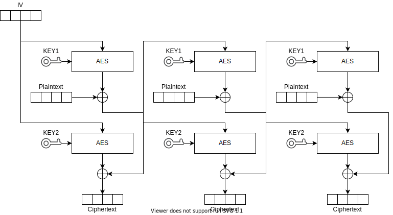

# OLD IDEAS

# Packets

## Started
Device sends this packet to inform that the bootloader just started and it is waiting for further communication. Additionally, this packet contains information needed to verify password and start a secure connection. It can be send more than once depending on the configuration.

| Enc | Off | Size   | Name       | Description                                            |
|-----|-----|--------|------------|--------------------------------------------------------|
|     | 0   | 8      | Salt       | Random salt bytes for device key generation            |
|     | 8   | 12     | IV         | Initialization vector for encryption of remaining data |
| Y   | 20  | 14     | ConnID     | Random Connection ID                                   |
| Y   | 34  | 1      | HW ID      | Value that identifies the hardware                     |
| Y   | 35  | 1      | Counter    | Packet repeat counter                                  |
| Y   | 36  | 16     | CheckBytes | All zeros                                              |
|     |     | **52** |            | **Total packet size**                                  |

***IV*** field contains last 12 bytes of initialization vector used to encrypt this packet.
First 4 bytes of the initialization vector are taken from the end of ***Salt***

***ConnID***, ***Counter*** and ***CheckBytes*** are encrypted using DCFB-AES with *IV* and *Key* parameters as described above.

***ConnID*** and ***Counter*** are used later to encrypt **block** packet.

***CheckBytes*** contains zeros.

***CheckBytes*** is used to check integrity and to authorize the packet. DCFB-AES has property of error propagation, so if
one encrypted byte was altered then block containing that byte and all following blocks will be altered. Because of that,
if any encrypted byte was altered, key or IV was invalid then ***CheckBytes*** field will be invalid.

## Block
Controller sends one block of second stage bootloader.

| Enc | Off | Size   | Name         | Description                         |
|-----|-----|--------|--------------|-------------------------------------|
|     | 0   | 2      | BlockIndex   | Block index                         |
| Y   | 2   | 64     | Content      | Content of the block                |
| Y   | 66  | 16     | CheckBytes   | Zeros                               |
|     |     | **82** |              | **Total packet size**               |

Packet is encrypted using DCFB-AES. IV is a concatenation of ***ConnID*** and ***BlockIndex***.

***BlockIndex*** is an index of current second stage bootloader block. Second stage bootloader is divided into 64-byte blocks indexed from zero. Padding should added to the last block if needed.

***CheckBytes*** are zeros and they are described in the **started** packet.

## Start
Controller sends hash of the second stage bootloader and requests start if valid.

| Enc | Off | Size   | Name         | Description                         |
|-----|-----|--------|--------------|-------------------------------------|
|     | 0   | 2      | BlockIndex   | 0xFFFF                              |
| Y   | 2   | 16     | Hash         | Hash of the bootloader              |
| Y   | 18  | 48     | Padding      | Ignored                             |
| Y   | 66  | 16     | CheckBytes   | Zeros                               |
|     |     | **82** |              | **Total packet size**               |

***BlockIndex*** is 0xFFFF to indicate that it is a **Start** packet.

***Hash** is a hash of entire space for second stage bootloader including unused blocks.

***CheckBytes*** are zeros and they are described in the **started** packet.

------------------------------------------------------------

# OLD IDEA 2

Below approach probably needs more flash size than available in the MBR unused space.

------------------------------------------------------------

# First stage packets format

First stage bootloader communication defines four types of packets.

## Catch
Controller sends this packet to *catch* bootloader before it exits.

| Off | Size | Name   | Description          |
|-----|------|--------|----------------------|
| 0   | 1    | Length | Always 14            |
| 1   | 1    | Type   | Always 0 (**catch**) |
| 2   | 12   | Data   | Magic data: 7e3d710b965f11e592562820 |

## Cougth
Device sends this packet to inform that it is *cougth* and waiting for further communication. Additionally,
this packet contains information needed to verify password and start secure connection.

| Enc | Off | Size | Name       | Description                                            |
|-----|-----|------|------------|--------------------------------------------------------|
|     | 0   | 1    | Length     | Always 50                                              |
|     | 1   | 1    | Type       | Always 1 (**cought**)                                  |
|     | 2   | 8    | Salt       | Random salt bytes for device key generation            |
|     | 10  | 12   | IV         | Initialization vector for encryption of remaining data |
| Y   | 22  | 12   | ConnID     | Random Connection ID                                   |
| Y   | 34  | 4    | Counter    | Random initial value of counter                        |
| Y   | 38  | 1    | Flags      | Flags: bit 0 - bootloader is running in safe mode      |
| Y   | 39  | 12   | CheckBytes | Copy of the beginning of the packet                    |

Each device has a unique encryption key generated from user provided *Password* using following method:
```
Salt = 8 random bytes
Key = SHA-256(Salt & Password & "RecoveryBootloaderPassword")
```
*& sign indicates concatenation.*

***Salt*** and *Key* are stored on the device. ***Salt*** is send by this packet allowing controller to generate device *Key* for this connection.

> SECURITY NOTE: ***Salt*** may be used to uniquly indentify the device. Because of that, this protocol cannot be used
> if device needs anonymity. This can be solved by using the same ***Salt*** on every device, but this solution creates the
> same key for each device, so breaking one device allows full access to all devices.

***IV*** field contains last 12 bytes of initialization vector used to encrypt this packet.
First 4 bytes of the initialization vector are taken from the end of ***Salt***

***ConnID***, ***Counter***, ***Flags*** and ***CheckBytes*** are encrypted using DCFB-AES with *IV* and *Key* parameters as described above.

***ConnID*** and ***Counter*** are used later to encrypt **request** and **response**.

***Flags*** byte contain one flag on bit 0 which is set when bootloader is running in safe mode.
Rest of bits are set to zero.

Safe mode is active when partial write of page 0 was done, so it is unknown how much of bootloader
is actually valid. Controller will use only core part of protocol: requests WRITE_BLOCK, GET_STATUS and START_APP.

***CheckBytes*** contains copy of the beginning of the packet (bytes from 0 to 11) before encryption was applyied.

***CheckBytes*** is used to check integrity and to authorize the packet. DCFB-AES has property of error propagation, so if
one encrypted byte was altered then block containing that byte and all following blocks will be altered. Because of that,
if any encrypted byte was altered, key or IV was invalid then ***CheckBytes*** field will be invalid. Additionally,
***CheckBytes*** is a copy of the beginning of the packet, so if unencrypted part of packet was altered then ***CheckBytes***
verification will also fail.

The same method of packet verification is used in the rest of packets types. Unencrypted part of the packet is always
smaller than ***CheckBytes***, so it is always verified by the integrity check.

If number of byte before ***CheckBytes*** is less than ***CheckBytes*** length then they are repeated to fill entire ***CheckBytes***
field, e.g. packet is "Abcde" and after that is ***CheckBytes*** field that contains "AbcdeAbcdeAb"


## Request
Controller requests device to do something.

| Enc | Off | Size | Name       | Description                         |
|-----|-----|------|------------|-------------------------------------|
|     | 0   | 1    | Length     | Total length of the packet          |
|     | 1   | 1    | Type       | Always 2 (**request**)              |
|     | 2   | 2    | LowCounter | Lower 16 bits of counter value      |
| Y   | 4   | N    | Request    | Content of the request              |
| Y   | 4+N | 12   | CheckBytes | Copy of the beginning of the packet |

Packet is encrypted using DCFB-AES. IV is a concatenation of ***ConnID*** and ***Counter***.
***ConnID*** was provided in the **cought** packet. ***Counter*** is 32-bit integer counter that is incremented by one on each new request.
Retransmission does not increment the counter. Initial value of ***Counter*** was provided in the **cought** packet.

***LowCounter*** contains lower 16 bits of ***Counter*** value. Device have to calculate higher bit of the counter based on ***LowCounter***
overflows.

***Request*** contains request body described below.

***CheckBytes*** are described in **caught** packet.

## Response
Device sends response to previous request if needed.

| Enc | Off | Size | Name       | Description                         |
|-----|-----|------|------------|-------------------------------------|
|     | 0   | 1    | Length     | Total length of the packet          |
|     | 1   | 1    | Type       | Always 3 (**response**)             |
| Y   | 2   | N    | Response   | Content of the response             |
| Y   | 2+N | 12   | CheckBytes | Copy of the beginning of the packet |

Packet is encrypted using DCFB-AES. IV is the same as in associated **request**.

***Response*** contains response body described below.

***CheckBytes*** are described in **caught** packet.

# Requests

## Get Device Info

Query for device information.

Request:
| Off | Size | Name | Description        |
|-----|------|------|--------------------|
| 0   | 1    | Id   | 0: GET_DEVICE_INFO |

Response:
| Off | Size | Name             | Description                                            |
|-----|------|------------------|--------------------------------------------------------|
| 0   | 2    | PagesAndArrdType | bits 0-14: Number of flash pages, bit 15: Address type |
| 2   | 1    | BlocksPerPage    | Number of 128-byte blocks in one flash page            |
| 3   | 1    | BlocksForRamApp  | Number of 128-byte blocks for second stage bootloader  |
| 4   | 8    | DeviceId[2]      | nRF5x device id                                        |
| 12  | 4    | AddrLow          | Lower 32 bits of nRF5x device address                  |
| 16  | 2    | AddrHi           | Higer 16 bits of nRF5x device address                  |
| 18  | 2    | HWID             | nRF5x hardware id                                      |
| 20  | N    | Name             | Device name                                            |

## Write block

Writes block of 128 bytes of second stage bootloader to RAM. Second stage boootloader is aligned to block boudary by padding with any value.

Request:
| Off | Size | Name  | Description    |
|-----|------|-------|----------------|
| 0   | 1    | Id    | 1: WRITE_BLOCK |
| 1   | 1    | Index | Block index    |
| 1   | 128  | Block | Block data     |

Response: **NONE**

## Get Status

Get status which blocks of second stage bootloader were received.

Request:
| Off | Size | Name | Description        |
|-----|------|------|--------------------|
| 0   | 1    | Id   | 2: GET_STATUS      |

Response:
| Off | Size | Name                 | Description                                     |
|-----|------|----------------------|-------------------------------------------------|
| 0   | N    | ReceivedBlocksBitmap | Bitmap containing bit 1 for each received block |

If block index 0 was received then bit 0 in byte 0 is set.
If block index 1 was received then bit 1 in byte 0 is set.
If block index 8 was received then bit 0 in byte 1 is set.
And so on.

GET_HASH request clears the bitmap.

## Get Hash

Get simple hash of received application.

Request:
| Off | Size | Name | Description        |
|-----|------|------|--------------------|
| 0   | 1    | Id   | 3: GET_HASH        |

Response:
| Off | Size | Name | Description                |
|-----|------|------|----------------------------|
| 0   | 16   | Hash | Hash calculated using SAHF |

If there are some missing blocks then resulting hash is unpredicable. This hash is not cryptographically secure.

## Start Application

Start second stage bootloader (RAM Application).

Request:
| Off | Size | Name | Description        |
|-----|------|------|--------------------|
| 0   | 1    | Id   | 4: START_APP       |

Response: **NONE**

## Start MBR

Shut down the bootloader and give control to MBR to start normal startup process.

Request:
| Off | Size | Name | Description        |
|-----|------|------|--------------------|
| 0   | 1    | Id   | 5: START_MBR       |

Response: **NONE**

# Notes

> NOTE: Over the air packets contains: Prelambule, Address, Length, Content and CRC.  This documents describes only Length and Content, because rest is handled by the nRF5x HW.

> NOTE: Integer values are stored in little endian byte order.


General information
-------------------

Bootloader is as small as possible. It has two main functionalities:

 * Start App from flash
 * Download App to RAM and start it
   * The App in RAM is responsible for rest of the work, e.g. flashing app or bootloader, changing config
 
Application running from RAM has no ISR support.

Flash organization
------------------

FOR NRF51
```
                                                                           v--- fixed address e.g. 1024
| modified vect table | bootloader | ... padding ... | conf: name, aes_key | original vect table | rest of APP .... |

```
modified vect table:
 * RESET -> bootloader RESET
 * Initial SP -> bootloader Initial SP
 * rest of vector table unchanged

FOR NRF52
```
                                                                     v--- fixed address 4096
| bootloader with vect table | ... padding ... | conf: name, aes_key | APP with its vector table ... |
```

bootloader is located at the region protected by PROTREG0 bit.

FOR SOFTDEVICE (both 51 and 52)

Bootloader is injected into unused space of MBR with reset vector patched to point to Recovery Bootloader.
Original reset vector of MBR is called if Recovery Bootloader was not activated.
Application and standard bootloader does not need special handling of Recovery Bootloader.

First stage communication example
---------------------------------
```
[programmer]    [devide]

{start discovery clicked}
send catch
wait
send catch
wait
send catch
wait
                power on
send catch
wait
send catch      {received}
wait            wait random
{receive error} send caught
send catch      {received}
wait            wait random
{received}      send caught

sendBlock 0
sendBlock 1
....
sendBlock 84
getStatus
               missing block bitmap
sendBlock 3
sendBlock 27
getStatus
               ok
runRAMApp
```

If bootloader was not catched then do softreset.
    After softreset check reset reason and go directly to the app.

RAM APP Communication example
---------------------
```
[programmer]    [devide]

erase pages 0..3
                erase done
sendBlock 1                   // block 0 is send at the end of programming
...
sendBlock 31; get status
                ok / missing block bitmap / error
erase pages 4..7
                erase done
sendBlock 32
...
sendBlock 347; get status
                ok / missing block bitmap / error
check HASH of blocks 1..347
                ok / error
> run user event
run app
                > soft reset
run app
run app
run app
run app
```

Radio parameters
----------------

 *   2Mbit,
 *   5 byte addr (MAGIC value, different for each side)
 *   8 bit LENGTH
 *   no S0, S1
 *   3 byte CRC (including address)
 
Hash algorithm
--------------

Hash can be calculated by AES based hash (small footprint because of HW AES accelerator):
```
output[16] = 0
foreach block[32] from input (padding by previous value of block or 0 if input.len < 32)
    output = AES(key = block[0..15], plaintext = output ^ block[16..31])
```

[](https://kildom.github.io/drawio/#img%2FSAHF.svg)<br/>
**Simple AES-based Hash Function (SAHF)**.
    
Encryption
----------
*  Both parts have generated AES key = sha256(password & devide unique address)
    * it is devided into two parts: KEY1, KEY2
    * device unique address is placed in 'send catched'
* device genrates random connection id (96 bits) and counter start value (32 bits).
* all further packets will have following structure:
    * lower 2 bytes of counter in plain text
        (higher 2 bytes of counter other end have to predict based on cyclic property of lower 2 bytes)
    * ciphertext = AES_DCTF(IV = conn_id & counter, content & zeros)
        (if receiving part gets zeros != 0 then packet was corrupted)
        (total overhead for encryption and authentication of each packet 2 + zeros bytes)
* counter is increased on each request (retransmission and response use the same counter value)

AES_DCTF provides:
   * full data security
   * error propagation
   * can use used instead of both AES_CFB and AES_PECB
   * the same algorithm for encryption and decrition, but with inverted KEYs
```
AES1(...) with KEY1, AES2(...) with KEY2
C[0] = AES2(IV) ^ T[0] ; T[0] = AES1(IV) ^ P[0]
C[1] = AES2(T[0]) ^ T[1] ; T[1] = AES1(T[0]) ^ P[1]
C[2] = AES2(T[1]) ^ T[2] ; T[2] = AES1(T[1]) ^ P[2]
...
P[0] = AES1(IV) ^ T[0] ; T[0] = AES2(IV) ^ C[0]
P[1] = AES1(T[0]) ^ T[1] ; T[1] = AES2(T[0]) ^ C[1]
P[2] = AES1(T[1]) ^ T[2] ; T[2] = AES2(T[1]) ^ C[2]
````

Euqlivement:
```
   AES_DCTF_ENCRYPT(key, iv, plain) = AES_CTF_DECRYPT(key2, iv, AES_CTF_ENCRYPT(key1, iv, plain))
   AES_DCTF_DECRYPT(key, iv, cipher) = AES_CTF_DECRYPT(key1, iv, AES_CTF_ENCRYPT(key2, iv, cipher))
```

AES key is located at the end of bootloader's flash page (end of flash). It is programmed the same time as entire bootloader.

[](https://kildom.github.io/drawio/#img%2FDCFB.svg)<br/>
**Double Cipher Feedback (DCFB)** encryption and decryption.

>> Warning!!! Wrong name should be DCFB instead of DCTF

```c++

#include <stdint.h>
#include <stdlib.h>
#include <string.h>

// In header file
#define AES_DCTF_ENCRYPT 0
#define AES_DCTF_DECRYPT 48

// In C file
#define KEY 0
#define PT 16
#define CT 32

#define KEY1 0
#define PT1 16
#define CT1 32
#define KEY2 48
#define PT2 64
#define CT2 80

#define HASH_IN1 64
#define HASH_IN2 80
#define HASH_OUT 96

#define BUFFER_BYTES 112

static uint8_t aes_buffer[BUFFER_BYTES];

static void do_aes(uint8_t* data)
{
    ECB->ECBDATAPTR = (uint32_t)data;
    ECB->TASKS_STARTECB = 1;
    while (!ECB->EVENTS_ENDECB);
    ECB->EVENTS_ENDECB = 0;
}

static void do_xor(uint8_t* data, const uint8_t* source, size_t size)
{
    size_t i;
    for (i = 0; i < size; i++)
    {
        data[i] ^= source[i];
    }
}

static void aes_dctf_block(uint8_t* data, size_t size, uint32_t mode)
{
    uint8_t* buffer1 = &aes_buffer[KEY1 + mode];
    uint8_t* buffer2 = &aes_buffer[KEY2 - mode];
    do_aes(buffer1); // buffer1 contains key=first_key, plain=iv
    do_xor(data, &buffer1[CT], size);
    memcpy(&buffer1[PT], data, size);
    do_aes(buffer2); // buffer2 contains key=second_key, plain=iv
    do_xor(data, &buffer2[CT], size);
    memcpy(&buffer2[PT], &buffer1[PT], size);
}

void aes_dctf_key(const uint8_t* key)
{
    memcpy(&aes_buffer[KEY1], key, 16);
    memcpy(&aes_buffer[KEY2], &key[16], 16);
}

void aes_dctf(uint8_t* data, size_t size, uint32_t mode, const uint8_t* iv)
{
    memcpy(&aes_buffer[PT1], iv, 16);
    memcpy(&aes_buffer[PT2], iv, 16);
    while (size > 0)
    {
        size_t this_size = (size > 16) ? 16 : size;
        aes_dctf_block(data, this_size, mode);
        size -= this_size;
        data += this_size;
    }
}

static void aes_hash_block(const uint8_t* data, size_t size)
{
    memcpy(&aes_buffer[HASH_IN1], data, size);
    do_xor(&aes_buffer[HASH_IN2], &aes_buffer[HASH_OUT], 16);
    do_aes(&aes_buffer[HASH_IN1]);
}

void aes_hash(const uint8_t* data, size_t size, uint8_t* hash)
{
    memset(&aes_buffer[HASH_IN1], 0, 48);
    while (size > 0)
    {
        size_t this_size = (size > 32) ? 32 : size;
        aes_hash_block(data, this_size);
        size -= this_size;
        data += this_size;
    }
    memcpy(hash, &aes_buffer[HASH_OUT], 16);
}
```


[](https://kildom.github.io/drawio/#img%2FRecoveryBootPackets.svg)
