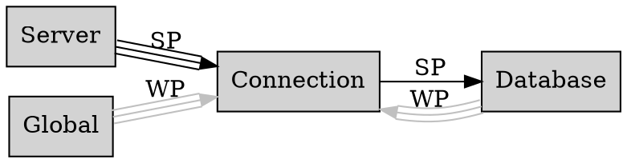

# SQLiteNode server software architecture

SQLiteNode is written in C++.

It uses [SQLite3MultipleCiphers](https://github.com/utelle/SQLite3MultipleCiphers) for encrypted database support.

## Source code file structure

- `src/`: Main source code for the SQLiteNode server.
  - `win/`: Windows-specific code
     - `Makefile`: makefile for building on Windows using MinGW
     - `socket.cpp`: Windows-specific socket handling functions.
     - `main.cpp`: Windows-specific entry point. If running with `--no-gui` flag, runs in console mode. Otherwise, creates a system tray icon and very basic window showing server status. Tray menu has two options: "Status" - toggle visibility of the status window, and "Exit" - shuts down the server and exits the application. By default, the status window is hidden and only the tray icon is shown. In GUI mode, if fatal error occurs (e.g. failed to bind to port), shows status window and displays message box with error details on top of status window.
     - `main.rc`: Windows application icons resource file.
     - `app.ico`: Application icon file.
     - `tray-active.ico`: System tray icon file show when server has active connections.
     - `tray-idle.ico`: System tray icon file show when server has no active connections.
  - `unix/`: Unix-specific code
     - `Makefile`: makefile for building on Unix-like systems using g++.
     - `socket.cpp`: Unix-specific socket handling functions.
     - `main.cpp`: Unix-specific entry point.
  - `server.cpp`: Multithreaded TCP server implementation, contains `Server` class.
  - `crypto.cpp`: Encryption and decryption of messages, authentication, and utilities, contains crypto-related classes.
  - `protocol.cpp`: Protocol parsing and message handling, contains `ProtocolHandler` class.
  - `database.cpp`: Database management, contains `Database` class.
  - `connection.cpp`: Client connection handling, contains `Connection` class.
  - `transaction.cpp`: Nested transaction management, contains `Transaction` class.
  - `commands.cpp`: Contains command storing, passing, parsing, and execution logic (maybe split into individual files per command type).
  - `logging.cpp`: Write and audit logging, contains `Logger` class.
  - TODO: More files
- `client/`: Source code for the client library and protocol documentation.

Files created by the build:
- `build/`: Compiled object files and build artifacts.
  - `release/`: Release artifacts.
  - `debug/`: Debug artifacts.
- `dist/`: Distribution packages.
  - `release/`: Release executables.
  - `debug/`: Debug executables.

## General concepts

### Pointers

The code relays on smart pointers and RAII for resource management.

* When possible use RAII.
* Use `std::unique_ptr` for exclusive ownership of resources when it is possible.
* Use `std::shared_ptr` if you cannot use `std::unique_ptr`. The `shared_ptr` means that the resource is owned by the container.
* Use `std::weak_ptr` whenever container is conceptually not the owner of the resource, but needs to reference it, e.g. reference to parent object.

Because smart pointers are used very often, aliases are defined:

* `SP<T>` - `std::shared_ptr<T>`
* `UP<T>` - `std::unique_ptr<T>`
* `WP<T>` - `std::weak_ptr<T>`

### Threads

The server is multithreaded. It uses C++ standard library threads and synchronization primitives.

## Main components

### `Server` class

The `Server` class is responsible for accepting incoming client connections, managing active connections, and coordinating the overall server operation.

### Component relationships

